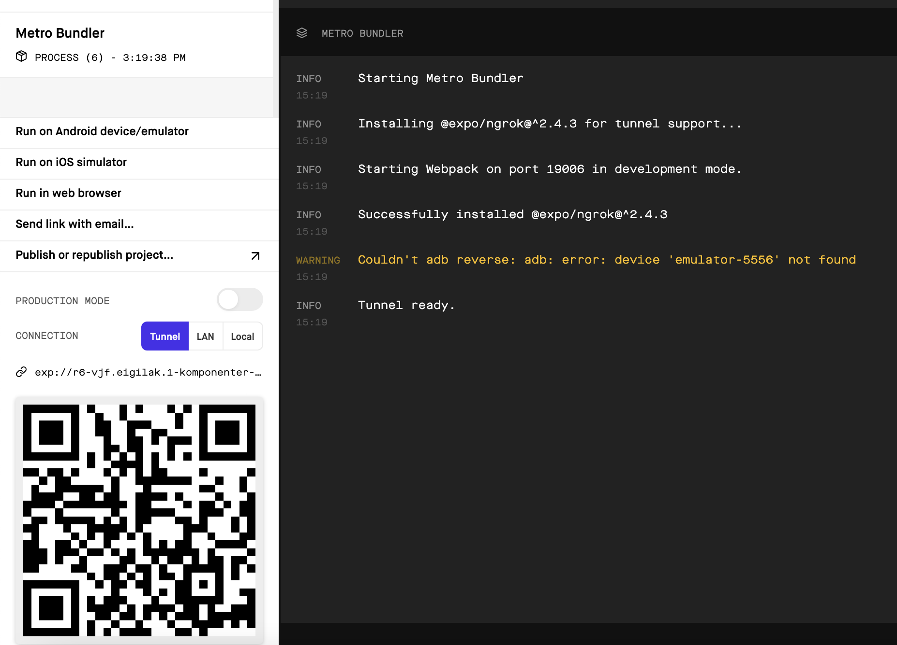

# Opsætning af expo - React native Mobil apps

#### Før du kan gå igang skal du have følgende:
1. **Command line developer tools** ( ikke et krav ) 
   1. Har du det installeret? tjek ved at skrive `xcode-select --version`i terminalen
   2. Installer command line developer tools med `xcode-select --install` i terminalen. 
   2. Du skal være færdig med at installere dette værktøj før du kan gå videre 
   3. Når det er færdig med at installere kør `xcode-select --version` for at tjekke om det er installeret, hvis du får versionnummer, så er du good to go 
2. **Node**
   1. Har du det installeret tjek ved at skrive følgende `Node -v`,
      og hvis den giver et version nummer som `12.18.3` så er du good to go    
   2. Hvis du får `zsh: command not found`, så hent det med homebrew ved først at skrive `brew update && brew upgrade && brew install node`
      3. Hvis du får en `Command not found ` med homebrew, så installer det ved at åbne din terminal og 
         kopier følgende ind i din terminal: `/bin/bash -c "$(curl -fsSL https://raw.githubusercontent.com/Homebrew/install/HEAD/install.sh)`
      4. Prøv nu at køre `brew install node`
      5. læs mere på https://brew.sh/index_da
      6. Hvis du får fejl ved brew upgrade, så kig på fejlene og ret dem ( )
   3. Når homebrew har installere node, så prøv at køre `Node -v` igen
   
3. ****watchman****
   1. Installere ved at åbne terminalen og køre `brew update && brew upgrade && brew install watchman`
   2.  Kør `watchman --v ` for at tjekke om det er installeret
   3. læs mere på https://facebook.github.io/watchman/docs/install.html 

#### Anvend den officielle guide til at installere expo guiden findes på følgende link: https://docs.expo.io/get-started/installation/
- OBS - Det er vigtigt at skrive npm install --global expo-cli og IKKE npm install expo-cli

Når installationen er færdig, skal du hente expo-app'en fra din AppStore.

- App-ikonet kan ses på billedet herunder
  
  

#### Kør dit først expo projekt!
1. find den mappe du vil oprette dit første projekt, og træk den mappe ned i terminalen, så mappe navnet står til venstre prompten

   
2. Skriv nu `expo init projektnavn` og vælg blank 
3. Find nu dit `projektnavn` og åben det i webstorm, og derefter i webstorms terminal kør 
`npm start`
   
   
4. Nu skal et vindue med expo intefacet åbne og tryk nu på tunnel i venstre side for at scanne din første app.
   
   
5. resultatet skulle være at du skal se denne tekst `Open up App.js to start working on your app!`
6. prøv at ændre i webstorm filen app.js og se teksten ændre sig

### Fejl og løsninger
1. Får du fejl med at installere watchman, så prøv at afinstallere homebrew og installer det igen : https://github.com/Homebrew/install
   - Kan også løse mange andre problemer med homebrew
2. Kan du ikke køre Tunnel funktionen med expo? --> stop serveren med control + c, også skriv npm install -global @expo/ngrok
3. Problemer med webstorm ikke kan oprette forbindelse: Bliv med at opdatere det til at du kan
4. Kan du ikke installere xcode-select --install eller går det for langsomt, så hop af eduroam, og gør det på din mobils wifi
